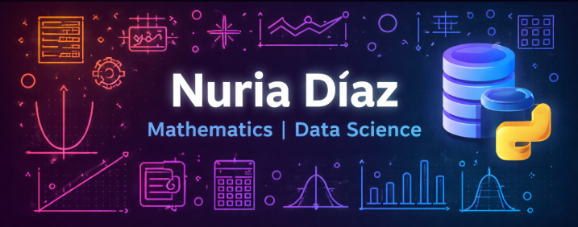

# Hola, soy Nuria 👋

🎓 Matemática por la Universidad de Sevilla – TFG en curso

## Sobre mí
Me interesa el área Data, más en concreto el análisis y la ingeniería de datos. Tengo capacidad de aprender rápido y adaptarme a nuevos lenguajes y herramientas.
Tengo gran iniciativa, por lo que estoy aprendiendo algunas de ellas para trabajar con pipelines de datos y en analítica.

## Habilidades técnicas
- Lenguajes: Python, SQL
- Python: Pandas
- Bases de datos: PostgreSQL, MySQL
- Visualización de datos: Power BI
- SQL: consultas a bases de datos relacionales, manipulación y filtrado de datos, definición de tablas, claves primarias y foráneas

## Habilidades personales
- Pensamiento analítico
- Proactividad
- Responsabilidad
- Trabajo en equipo

## Interesada en aprender
- PySpark
- Scala
- Snowflake
- Bases de datos NoSQL (MongoDB)
- Databricks
- Entornos cloud (AWS, Microsoft Azure, Google Cloud)

## Proyectos
🔹 Currency Data API Pipeline: Desarrollo de un pipeline básico en Python mediante implementación de funciones automatizadas con datos extraidos desde una API pública.
🔹 Pipeline de datos usando Python y PostgreSSQL (próximamente)
